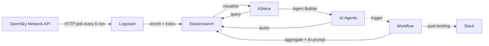

# ADS-B Flight Tracking with the Elastic Stack

Live aircraft position tracking powered by [OpenSky Network](https://opensky-network.org) and the Elastic Stack. Logstash pipelines poll the OpenSky REST API for real-time ADS-B transponder data, enrich each position with country/region geo-shapes, and index everything into an Elasticsearch data stream for visualisation in Kibana.

> **Data source** - All flight data is provided by [The OpenSky Network](https://opensky-network.org), a community-based receiver network that collects air traffic surveillance data and makes it freely available for research and non-commercial purposes. No data is bundled in this repository; it is fetched live from the OpenSky API at runtime.
>
> If you use this project, please review the [OpenSky Network terms of use](https://opensky-network.org/about/terms-of-use).


## Architecture



Each pipeline covers one quadrant of the globe. Splitting the world into four smaller queries is more efficient than a single global request.

| Pipeline  | Coverage                    | Bounding box                |
| --------- | --------------------------- | --------------------------- |
| `adsb-q1` | North-West (Americas/North) | lat 0 to 90, lon -180 to 0  |
| `adsb-q2` | North-East (Europe/Asia)    | lat 0 to 90, lon 0 to 180   |
| `adsb-q3` | South-West (Americas/South) | lat -90 to 0, lon -180 to 0 |
| `adsb-q4` | South-East (Africa/Oceania) | lat -90 to 0, lon 0 to 180  |

All four pipelines write to the same `demos-aircraft-adsb` data stream. An ingest pipeline enriches each document with country/region metadata and nearest airport proximity via geo-shape enrich policies.

### Pipeline Design — Polling with OAuth2

The OpenSky API requires an OAuth2 bearer token (client-credentials grant via Keycloak). Logstash's `http_poller` input plugin can poll a URL on a schedule but only supports basic auth and static headers — it cannot perform an OAuth2 token exchange before each request, so it won't work here.

The pipelines work around this by chaining a `heartbeat` input with two `http` filter plugins:

```txt
heartbeat (every 360 s)
  │
  ▼
http filter ── POST /token ──▶ Keycloak (OpenSky)
  │                              │
  │  [@metadata][token_response] ◀─ { access_token: "…" }
  │
  ▼
http filter ── GET /states/all ──▶ OpenSky REST API
  │            Authorization: Bearer <token>
  │
  ▼
split / mutate / date ──▶ elasticsearch output
```

1. **`heartbeat` input** — generates a synthetic event every 360 seconds, acting as the poll timer.
2. **`http` filter (token)** — performs an OAuth2 client-credentials grant against the OpenSky Keycloak endpoint. The access token is stored in `[@metadata]` so it is ephemeral and never indexed.
3. **`http` filter (API)** — calls the OpenSky `/states/all` endpoint with the bearer token from step 2 interpolated into the `Authorization` header. The bounding-box query parameters differ per quadrant.

If either HTTP call fails, the event is tagged `_httprequestfailure` and dropped before reaching the output. This pattern is reusable for any Logstash pipeline that needs to poll an OAuth2-protected REST API on a schedule.

### AI Agent

The setup script deploys three AI agents via the Kibana Agent Builder:

- **Aircraft ADS-B Tracking Specialist** — answers natural-language questions about flight data: locate aircraft by callsign or ICAO24, query positions over geographic regions, analyse altitude and speed patterns, and aggregate flights by country or region. Includes an **aircraft history report** tool that generates comprehensive reports for individual aircraft — flight itinerary with callsigns and airports, airframe details from [adsbdb](https://www.adsbdb.com), live position from [adsb.lol](https://adsb.lol), related Kibana cases, and a link to the Aircraft Detail dashboard. Also includes a **defunct callsign detector** that scans for aircraft using callsign prefixes from known defunct airlines.
- **ADS-B Daily Briefing Analyst** — generates and discusses daily aviation briefings from aggregated ADS-B data.
- **Squawk 7500 Hijack Assessment Analyst** — evaluates squawk 7500 (hijack) signals using flight history, external enrichment, and AI-powered false-positive analysis.

Once deployed, agents are available in Kibana under **AI Agents** (or via the `POST /api/agent_builder/converse` API).

Make sure you have an [LLM configured in Kibana](https://www.elastic.co/docs/explore-analyze/ai-features/llm-guides/llm-connectors), select an agent and throw some natural language querying its way.

### Workflows

The setup script deploys several [Elastic Workflows](https://www.elastic.co/docs/explore-analyze/workflows) (Preview, Stack 9.3+):

**Daily Flight Briefing** — runs automatically at 08:00 Europe/London each day:

1. Aggregates 24 hours of ADS-B data — unique aircraft, busiest airports, top origin countries, regional traffic by UN subregion, activity breakdown, and emergency squawk codes (7500/7600/7700)
2. Invokes the **ADS-B Daily Briefing Analyst** agent to generate a natural-language briefing from the aggregation results
3. Posts the briefing to a Slack channel (if a Slack connector is configured)

**Squawk 7500 Hijack Investigation** — triggered automatically by an ES|QL alert rule when an aircraft transmits squawk code 7500 (hijack). The alert uses per-row grouping so each aircraft gets its own alert and workflow execution. The workflow:

1. Deduplicates against existing open Kibana Cases (one investigation per aircraft)
2. Creates a new case with aircraft details and attaches the triggering alert
3. Enriches with flight history, aircraft registry (adsbdb), live position (adsb.lol), and news articles (GNews)
4. Invokes the **ADS-B Hijack Assessment** agent for AI-powered false-positive analysis
5. Routes based on AI triage assessment — Slack notification for genuine threats, tagging for false positives

**Aircraft History Report** — triggered by the ADS-B tracking agent when a user asks about a specific aircraft's recent movements (e.g. "where has 406bbb been in the last 30 days?"). The workflow gathers flight summary aggregations, position samples, airframe details from adsbdb, live position from adsb.lol, and related Kibana cases. The agent composes the data into a structured markdown report with a link to the Aircraft Detail dashboard.

**Defunct Callsign Detector** — runs daily at 07:30 Europe/London and on-demand via the ADS-B tracking agent. Uses ES|QL LOOKUP JOIN to cross-reference live ADS-B callsign prefixes against a lookup index of 781 known defunct airlines (sourced from Wikipedia). Detects aircraft broadcasting callsign prefixes from airlines that have ceased operations — results are investigative leads for stale transponder configurations, reallocated ICAO designators, or suspicious activity. Also runs inline as part of the Daily Flight Briefing.

Supporting workflows (`squawk-7500-enrich`, `squawk-7500-create-case`, `hijack-cases-summary`, `adsb-aggregate-stats`) are deployed as agent tools.

> **Known limitation (Stack 9.3.x)** — Elastic Workflows is a Preview feature, and behaviour may differ between deployment types. Workflow `outputs` are not yet functional on Elastic Stack / Cloud Hosted 9.3.x ([#9](https://github.com/face0b1101/adsb-demo/issues/9)). Agent-tool workflows include `outputs` sections but the runtime ignores them, so agents receive `null` output and fall back to direct ES queries. As a workaround, workflows with HTTP steps write external API responses to the `adsb-enrichment-cache` index; agents query this index as a fallback. This workaround will be removed once outputs are functional ([#12](https://github.com/face0b1101/adsb-demo/issues/12)). The feature works correctly on Elastic Cloud Serverless.

> **Observability features** — This demo leverages Elastic Observability capabilities including the Observability solution view (Kibana space), Cases (`owner: observability`), and alerting (`consumer: observability`). The full experience requires a deployment that supports these features — see the [deployment comparison table](#getting-started-with-elasticsearch).

**Prerequisites for workflows and agents:**

- **LLM connector** — an AI connector (OpenAI, Gemini, etc.) must be [configured in Kibana](https://www.elastic.co/docs/explore-analyze/ai-features/llm-guides/llm-connectors) as the default AI connector. The workflows and agents use whichever connector is set as the default.
- **Agent Builder** — enable the Agent Builder in Kibana: _Stack Management > AI Settings > Generative AI > Agent Builder_ and toggle it on.
- **Workflows** — enable the Workflows UI in Kibana: _Stack Management > Advanced Settings_ > search for `workflows:ui:enabled` and set it to `true`.
- **Dark mode (optional)** — if preferred, enable dark mode for your space: _Stack Management > Advanced Settings_ > search for `theme:darkMode` and set it to `Enabled`.
- **Slack (optional)** — to receive briefings in Slack, [create a Slack app](https://api.slack.com/messaging/webhooks) with an incoming webhook and add the webhook URL to `.env` as `SLACK_WEBHOOK_URL`. The setup script creates the Kibana connector automatically. Alternatively, configure the connector manually in Kibana under Stack Management > Connectors.
- **Cases (optional)** — the squawk 7500 hijack investigation workflow uses Kibana Cases for full functionality — tracking triage assessments, deduplication, and Slack routing. Cases are available on Cloud Hosted, Observability Serverless, and start-local (see the [deployment comparison table](#getting-started-with-elasticsearch)). Workflows use `owner: observability` for case management. Without Cases (e.g. Elasticsearch Serverless), the workflow and daily briefing still operate but skip case management and investigation-outcomes sections gracefully.
- **GNews (optional)** — the hijack investigation and enrichment workflows correlate squawk 7500 signals with news articles via the [GNews API](https://gnews.io). Sign up for a free API key (100 requests/day) and add it to `.env` as `GNEWS_API_KEY`. The free tier has a 12-hour article delay; the paid Essential tier provides real-time results. If not set, the news correlation step is skipped gracefully.

## Getting Started with Elasticsearch

You need a running Elasticsearch cluster and Kibana instance to receive the data. Three options are supported:

| Option                                                                          | Cases | Alert-triggered workflows | Notes                                                                                        |
| ------------------------------------------------------------------------------- | :---: | :-----------------------: | -------------------------------------------------------------------------------------------- |
| **Elastic Cloud Hosted** ([elastic.co/cloud](https://elastic.co/cloud))         |  Yes  |            Yes            | Full-featured managed deployment. Recommended for the full demo experience.                  |
| **Observability Serverless** ([elastic.co/cloud](https://elastic.co/cloud))     |  Yes  |            Yes            | Serverless project with Cases and alerting. Choose this if you want serverless.              |
| **start-local** ([elastic/start-local](https://github.com/elastic/start-local)) |  Yes  |            Yes            | Local Docker deployment. Run `curl -fsSL https://elastic.co/start-local \| sh`.              |
| Elasticsearch Serverless                                                        |  No   |            No             | Core ingestion and dashboards work, but Cases and alert-triggered workflows are unavailable. |

> **Note** — The hijack investigation workflow uses Kibana Cases to record investigation outcomes. On deployments without Cases support the workflow still runs but skips case creation gracefully (`on-failure: continue`). All other features — ingestion, dashboards, AI agents, the daily briefing — work on every deployment type.

Your Elasticsearch and Kibana endpoint URLs are shown on the deployment overview page (Cloud) or at the end of the install (start-local). You will also need an API key — see below.

## Generate an API Key

Open Kibana, head to **Dev Tools** (_hint_: it's in the bottom left), copy and run the following:

```json
POST /_security/api_key
{
  "name": "adsb-demo",
  "role_descriptors": {
    "adsb_setup": {
      "cluster": [
        "manage",
        "manage_security"
      ],
      "indices": [
        {
          "names": [
            "geo.shapes-world.countries-50m",
            "adsb*",
            "demos-aircraft-adsb*"
          ],
          "privileges": ["create_index", "write", "read", "view_index_metadata", "manage"]
        }
      ],
      "applications": [
        {
          "application": "kibana-.kibana",
          "privileges": ["all"],
          "resources": ["*"]
        }
      ]
    }
  }
}
```

> **Privileges** — `manage_security` is required for the automated [service user](#service-user-automated) that ensures correct attribution of workflow actions in Kibana Cases. The `all` application privilege is equivalent to the `kibana_admin` built-in role — it grants full access to all Kibana features across all spaces, including space management, saved objects, AI agents, workflows, connectors, alerting rules, cases, and advanced settings. This works identically on Cloud Hosted, Observability Serverless, and start-local — each deployment exposes only the features it supports. If your existing API key lacks `manage_security`, `setup.sh` falls back gracefully — the service user step is skipped and actions are attributed to the API key owner.

From the response, copy the three values into your `.env` file:

```secrets
ES_API_KEY_ID=VuaCfGcBCdbkQm-e5aOx
ES_API_KEY=ui2lp2axTNmsyakw9tvNnw
ES_API_KEY_ENCODED=VnVhQ2ZHY0JDZGJrUW0tZTVhT3g6dWkybHAyYXhUTm1zeWFrdzl0dk5udw==
```

`setup.sh` uses the base64-encoded key for REST calls; Logstash uses the `id:key` pair directly.

## Quick Start

### 1. Prerequisites

- Docker and Docker Compose
- An [OpenSky Network](https://opensky-network.org/register) account (free)
- An Elasticsearch cluster (see above)

### 2. Configure

```bash
cp .env.example .env
```

Edit `.env` and fill in your credentials:

```sh
ES_ENDPOINT=https://my-deployment.es.us-central1.gcp.cloud.es.io
ES_API_KEY_ID=VuaCfGcBCdbkQm-e5aOx
ES_API_KEY=ui2lp2axTNmsyakw9tvNnw
ES_API_KEY_ENCODED=VnVhQ2ZHY0JDZGJrUW0tZTVhT3g6dWkybHAyYXhUTm1zeWFrdzl0dk5udw==
KB_ENDPOINT=https://my-deployment.kb.us-central1.gcp.cloud.es.io
KB_SPACE=adsb              # optional — deploy into a named Kibana space

OPENSKY_API_CLIENT_ID=your_opensky_client_id
OPENSKY_API_CLIENT_SECRET=your_opensky_client_secret
```

> **Kibana Spaces** — Set `KB_SPACE` to deploy all Kibana resources (dashboards, agents, workflows) into a dedicated space. `setup.sh` creates the space automatically with the Observability solution view. Leave `KB_SPACE` empty to use the default space.

### 3. Set up Elasticsearch

Run the setup script to create the geo-shapes and airports indices, enrich policies, ingest pipeline, index template, import Kibana saved objects (dashboards, data views), deploy the AI agents, and set up the daily briefing workflow. The script reads `ES_ENDPOINT`, `ES_API_KEY_ENCODED`, and `KB_ENDPOINT` from your `.env` file.

```bash
make setup        # or: ./setup.sh
```

The script is safe to re-run — existing resources are skipped by default. Use `--only` to run specific groups and `--force` to overwrite existing resources:

```bash
./setup.sh --only agents,workflows   # Re-deploy agents and workflows only
./setup.sh --only kibana --force     # Reset dashboards to source-controlled versions
./setup.sh --force                   # Overwrite everything
./setup.sh --help                    # Show available groups and flags
```

Available groups: `space`, `ilm`, `indices`, `enrich`, `pipelines`, `kibana`, `agents`, `workflows`. There are also `make` shortcuts for each group — see [Make Targets](#make-targets) below.

### 4. Run

```bash
make up           # or: docker compose up -d
```

All four quadrant pipelines start automatically. Each polls OpenSky every 6 minutes and writes to the `demos-aircraft-adsb` data stream.

### 5. Verify

Check logs:

```bash
make logs         # or: docker compose logs -f logstash
```

Confirm all pipelines are running:

```bash
make status       # or: docker compose exec logstash curl -s localhost:9600/_node/pipelines?pretty
```

You should see `adsb-q1` through `adsb-q4` in the response.

## Stopping

```bash
make down         # or: docker compose down
```

## Make Targets

Run `make help` to see all available targets. Every target is a thin wrapper around `setup.sh` or `docker compose`.

### Setup / Deploy

| Command                 | Description                                                  |
| ----------------------- | ------------------------------------------------------------ |
| `make setup`            | Run full Elasticsearch setup (skip existing)                 |
| `make deploy-ilm`       | Deploy ES ILM policy (skipped on Serverless)                 |
| `make deploy-indices`   | Deploy ES index templates and data streams                   |
| `make deploy-enrich`    | Deploy ES enrich policies                                    |
| `make deploy-pipelines` | Deploy ES ingest pipelines                                   |
| `make deploy-kibana`    | Deploy Kibana saved objects (dashboards, data views)         |
| `make deploy-workflows` | Deploy Kibana workflows                                      |
| `make deploy-agents`    | Deploy Kibana AI agents                                      |
| `make deploy-es`        | Deploy all ES resources (ilm + indices + enrich + pipelines) |
| `make deploy-ai`        | Deploy AI layer (workflows + agents)                         |
| `make redeploy`         | Re-deploy all resources with `--force`                       |

Any deploy target accepts `FORCE=1` to overwrite existing resources:

```bash
make deploy-agents FORCE=1
make setup FORCE=1
```

### Logstash

| Command        | Description                           |
| -------------- | ------------------------------------- |
| `make up`      | Start Logstash                        |
| `make down`    | Stop Logstash                         |
| `make logs`    | Tail Logstash logs                    |
| `make restart` | Restart Logstash after config changes |
| `make status`  | Show Logstash pipeline status         |
| `make clean`   | Stop Logstash and remove volumes      |

### Diagnostics

| Command         | Description                                |
| --------------- | ------------------------------------------ |
| `make validate` | Validate Docker Compose config             |
| `make health`   | Check Elasticsearch cluster health         |
| `make ps`       | Show running containers                    |
| `make shell`    | Open a shell inside the Logstash container |

## Project Structure

```sh
.
├── docker-compose.yml
├── .env.example
├── setup.sh                                          # Setup script (--only, --force supported)
├── data/
│   ├── geo-shapes-world-countries-50m-data.json      # Country boundary geo-shapes (bulk data)
│   ├── adsb-airports-geo-data.ndjson                 # 893 airports with multilingual names, ICAO codes, and coverage polygons
│   ├── adsb-airlines-defunct-data.ndjson              # 781 defunct airlines with ICAO codes (Wikipedia, CC BY-SA 4.0)
│   ├── adsb-airlines-defunct-LICENCE.md               # CC BY-SA 4.0 attribution for the defunct airlines dataset
│   └── scrape-defunct-airlines/                       # Optional Python tool to regenerate defunct airlines data
├── elasticsearch/
│   ├── agents/
│   │   ├── adsb-agent.json                           # AI agent definition (Aircraft ADS-B Tracking Specialist)
│   │   ├── adsb-daily-briefing-agent.json            # AI agent definition (Daily Briefing Analyst)
│   │   └── adsb-hijack-assessment-agent.json         # AI agent definition (Hijack Assessment)
│   ├── enrich/
│   │   ├── adsb-geo-enrich-policy.json               # Country geo-shape enrich policy
│   │   └── adsb-airport-enrich-policy.json           # Airport proximity enrich policy
│   ├── indices/
│   │   ├── geo-shapes-world-countries-50m-mapping.json # Source index mapping for country boundaries
│   │   ├── adsb-airports-geo-mapping.json            # Source index mapping for airports (Natural Earth + coverage)
│   │   ├── adsb-airlines-defunct-mapping.json         # Lookup index mapping for defunct airlines
│   │   └── adsb-index-template.json                  # Index template for the data stream
│   ├── kibana/
│   │   └── adsb-saved-objects.ndjson                 # Kibana saved objects (dashboards, data views)
│   ├── pipelines/
│   │   └── adsb-ingest-pipeline.json                 # Ingest pipeline (enrich + trim)
│   └── workflows/
│       ├── adsb-aggregate-stats.yaml                 # Workflow: 24h ADS-B aggregation (agent tool)
│       ├── daily-flight-briefing.yaml                # Workflow: daily AI-powered flight briefing
│       ├── squawk-7500-hijack-investigation.yaml     # Workflow: alert-triggered hijack investigation
│       ├── squawk-7500-enrich.yaml                   # Workflow: hijack enrichment (agent tool)
│       ├── squawk-7500-create-case.yaml              # Workflow: case creation/update (agent tool)
│       ├── hijack-cases-summary.yaml                 # Workflow: hijack cases summary (agent tool)
│       ├── adsb-aircraft-history.yaml                # Workflow: aircraft history report (agent tool)
│       └── adsb-defunct-callsign-detector.yaml        # Workflow: defunct callsign detection (ES|QL LOOKUP JOIN)
└── logstash/
    ├── config/
    │   ├── logstash.yml                              # Logstash node settings
    │   └── pipelines.yml                             # Registers all 4 quadrant pipelines
    └── pipeline/
        ├── adsb_q1.conf                              # Q1 - North-West
        ├── adsb_q2.conf                              # Q2 - North-East
        ├── adsb_q3.conf                              # Q3 - South-West
        └── adsb_q4.conf                              # Q4 - South-East
```

## Optional: Centralised Pipeline Management

Instead of managing pipeline `.conf` files on disk, you can use Kibana's [Centralised Pipeline Management](https://www.elastic.co/docs/reference/logstash/configuring-centralized-pipelines) (CPM) to create, edit, and delete pipelines from the UI. Pipelines are stored in Elasticsearch and pulled by Logstash automatically.

This repo ships with a toggle — set one environment variable and Logstash switches from local file mode to centralised mode.

### 1. Enable in `.env`

```sh
LS_CENTRALIZED_MGMT=true
```

When `true`, Logstash fetches pipeline configs from Elasticsearch for the four quadrant pipeline IDs (`adsb-q1` through `adsb-q4`). The local `pipelines.yml` and `.conf` files are silently ignored for those IDs. When `false` (the default), Logstash reads from local files as normal.

### 2. Create pipelines in Kibana

1. Go to **Management > Ingest > Logstash Pipelines**.
2. Create a pipeline for each ID (`adsb-q1` through `adsb-q4`) and paste the corresponding config from `logstash/pipeline/`.

### 3. Restart Logstash

```bash
make restart      # or: docker compose restart logstash
```

## Changing Log Level at Runtime

The Logstash node API (port 9600) is protected by the `LS_API_USER` / `LS_API_PW` credentials you set in `.env` (defaults: `logstash` / `changeme`).

```bash
curl -XPUT -u "${LS_API_USER}:${LS_API_PW}" \
  'localhost:9600/_node/logging?pretty' \
  -H 'Content-Type: application/json' \
  -d '{"logger.logstash.outputs.elasticsearch":"DEBUG"}'
```

Reset to defaults:

```bash
curl -XPUT -u "${LS_API_USER}:${LS_API_PW}" \
  'localhost:9600/_node/logging/reset?pretty'
```

## Known Issues

| #   | Summary                                                             | Upstream                                                                 |
| --- | ------------------------------------------------------------------- | ------------------------------------------------------------------------ |
| 1   | Workflows API `lastExecution` always returns `null` after execution | [elastic/kibana#257744](https://github.com/elastic/kibana/issues/257744) |
| 2   | Cases `_find` API `tags` parameter uses OR logic with no AND option | [elastic/kibana#257743](https://github.com/elastic/kibana/issues/257743) |

## Data Source and Attribution

Flight tracking data is provided by [The OpenSky Network](https://opensky-network.org).

> Matthias Schäfer, Martin Strohmeier, Vincent Lenders, Ivan Martinovic and Matthias Wilhelm.
> "Bringing Up OpenSky: A Large-scale ADS-B Sensor Network for Research".
> In _Proceedings of the 13th IEEE/ACM International Symposium on Information Processing in Sensor Networks (IPSN)_, pages 83-94, April 2014.

This project is not affiliated with or endorsed by the OpenSky Network. Please review the [OpenSky Network terms of use](https://opensky-network.org/about/terms-of-use) before operating this demo.

Defunct airline reference data is derived from the [List of defunct airlines](https://en.wikipedia.org/wiki/List_of_defunct_airlines) articles on Wikipedia, authored by Wikipedia contributors, and is licensed under the [Creative Commons Attribution-ShareAlike 4.0 International](https://creativecommons.org/licenses/by-sa/4.0/) licence (CC BY-SA 4.0). See `data/adsb-airlines-defunct-LICENCE.md` for full attribution and scope.
