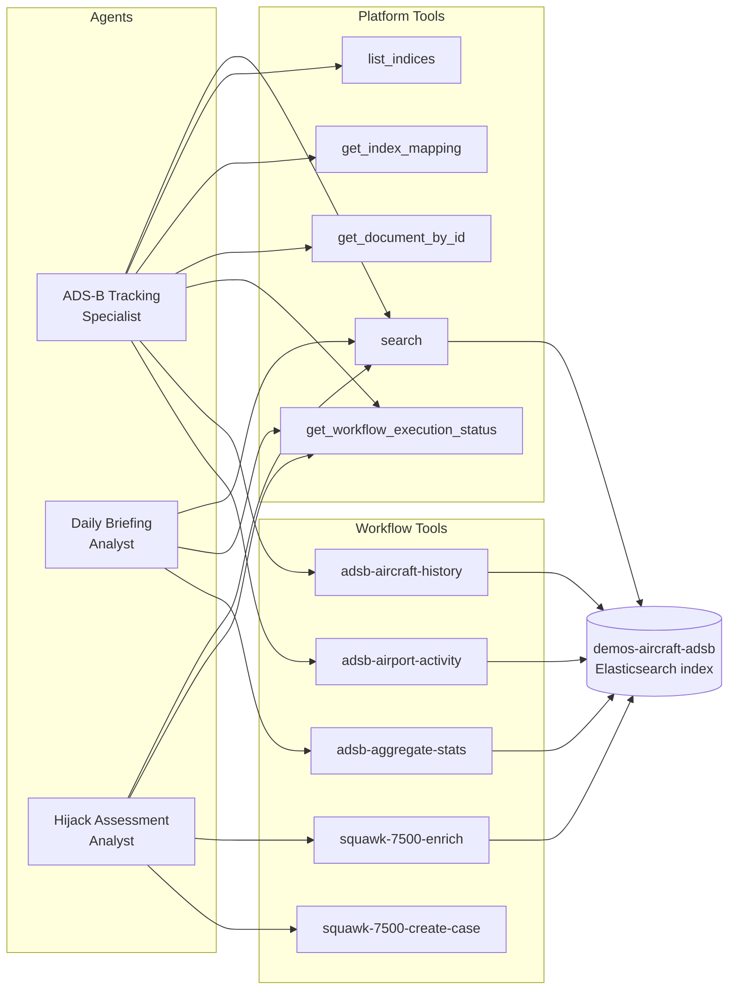
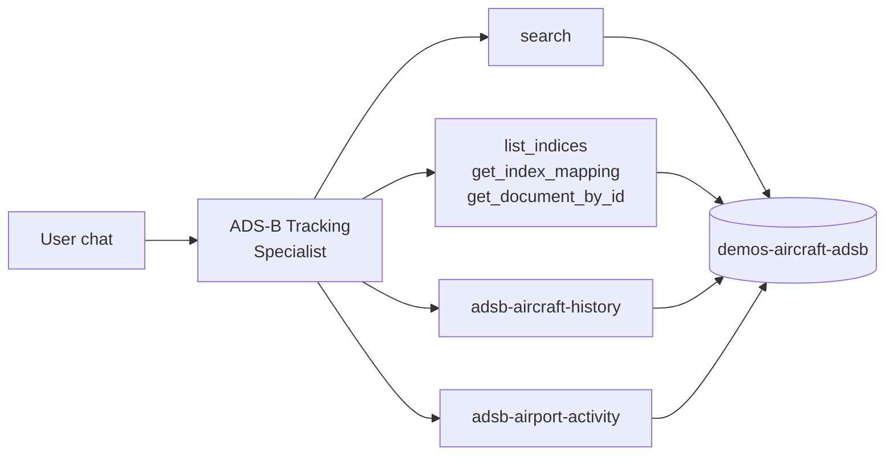
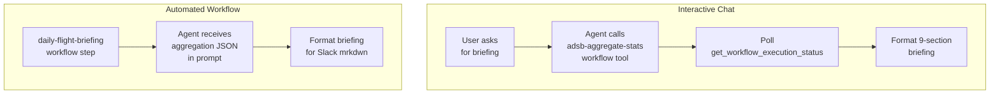
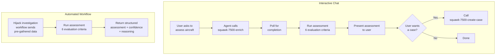

# Agents

Each JSON file in this directory defines a Kibana Agent Builder agent. Agents are
conversational AI assistants deployed to the Elastic Stack via `setup.sh` (or
`make setup`). Once deployed, they are accessible through the Agent Builder chat
interface in Kibana, where users can ask questions and trigger workflow tools
directly from the conversation.

Agents combine a system prompt (instructions), a set of tools (platform APIs and
workflow tools), and display metadata (name, avatar, labels). The system prompt
tells the model what it knows, how to behave, and which tools to call for
different tasks.

## Inventory

| File                                | Agent ID                       | Purpose                                                          |
| ----------------------------------- | ------------------------------ | ---------------------------------------------------------------- |
| `adsb-agent.json`                   | `adsb_agent`                   | General-purpose flight tracking and ad-hoc ADS-B queries         |
| `adsb-daily-briefing-agent.json`    | `adsb_daily_briefing_agent`    | Generate and discuss daily ADS-B flight briefings                |
| `adsb-hijack-assessment-agent.json` | `adsb_hijack_assessment_agent` | Assess squawk 7500 (hijack) signals as genuine or false positive |

## System overview

The diagram below shows how the three agents relate to their tools, workflow
integrations, and the underlying data.



> Platform tools are built-in Kibana APIs. Workflow tools are Kibana Workflows
> registered as callable tools -- see the
> [workflows README](../workflows/README.md) for full details on each workflow.

______________________________________________________________________

## 1. Aircraft ADS-B Tracking Specialist

**File:** `adsb-agent.json`
**Agent ID:** `adsb_agent`
**Labels:** `adsb`, `aircraft`, `Demo`
**Index:** `demos-aircraft-adsb`

A general-purpose agent for querying and analysing live ADS-B flight data. It
has direct access to Elasticsearch platform tools for ad-hoc queries and two
workflow tools for structured reports: per-aircraft history and per-airport
activity.

**Tools:**

| Tool                                          | Purpose                                           |
| --------------------------------------------- | ------------------------------------------------- |
| `platform.core.search`                        | Query the ADS-B index                             |
| `platform.core.list_indices`                  | Discover available indices                        |
| `platform.core.get_index_mapping`             | Inspect field mappings                            |
| `platform.core.get_document_by_id`            | Fetch a single document                           |
| `platform.core.get_workflow_execution_status` | Check workflow run status                         |
| `adsb-aircraft-history`                       | Aircraft history report (aggregations + external) |
| `adsb-airport-activity`                       | Airport activity report (ES\|QL)                  |

**Capabilities:**

- Locate aircraft by callsign, ICAO24 address, or geographic region
- Filter by altitude ranges, speed, heading, climb/descent rate
- Distinguish airborne vs ground aircraft
- Run aggregations (flights by country, region, altitude bands)
- Execute geospatial queries (bounding box, radius)
- Track aircraft movements over time
- Generate structured aircraft history reports (via `adsb-aircraft-history`)
- Generate structured airport activity reports (via `adsb-airport-activity`)



______________________________________________________________________

## 2. ADS-B Daily Briefing Analyst

**File:** `adsb-daily-briefing-agent.json`
**Agent ID:** `adsb_daily_briefing_agent`
**Labels:** `adsb`, `workflow`, `briefing`, `Demo`
**Avatar:** purple (`#6f42c1`), symbol **DB**
**Index:** `demos-aircraft-adsb`

Generates structured daily flight briefings from 24-hour ADS-B aggregations. In
interactive chat, it calls the `adsb-aggregate-stats` workflow tool to fetch
data, polls for completion, then formats a 9-section briefing. It can also
answer follow-up questions about specific airports, regions, or anomalies using
direct search.

This agent is also invoked automatically by the `daily-flight-briefing` workflow
as an `ai.agent` step -- in that path, aggregation results are passed directly
in the prompt and the agent formats them for Slack.

**Tools:**

| Tool                                          | Purpose                                |
| --------------------------------------------- | -------------------------------------- |
| `platform.core.search`                        | Ad-hoc queries for follow-up questions |
| `platform.core.get_workflow_execution_status` | Poll workflow completion               |
| `adsb-aggregate-stats`                        | Trigger 24 h aggregation workflow      |

**Briefing sections:**

1. Total observations and unique aircraft
2. Top 5 busiest airports (IATA + full name, unique flights)
3. Top 5 origin countries (unique aircraft)
4. Airport activity breakdown (arriving, departing, taxiing, overflight, at_airport)
5. Regional traffic (top 10 UN subregions)
6. Continent overview
7. Ground vs airborne ratio
8. Emergency squawks (7500, 7600, 7700)
9. Notable findings



______________________________________________________________________

## 3. Squawk 7500 Hijack Assessment Analyst

**File:** `adsb-hijack-assessment-agent.json`
**Agent ID:** `adsb_hijack_assessment_agent`
**Labels:** `adsb`, `squawk-7500`, `security`, `Demo`
**Avatar:** red (`#dc3545`), symbol **HA**
**Index:** `demos-aircraft-adsb`

An aviation security analyst that evaluates whether a squawk 7500 (hijack)
transponder code is genuine or a false positive. It uses flight history,
aircraft registry data, live tracking cross-references, and news search to
build an evidence-based assessment.

**Tools:**

| Tool                                          | Purpose                                               |
| --------------------------------------------- | ----------------------------------------------------- |
| `platform.core.search`                        | Ad-hoc queries against ADS-B data                     |
| `platform.core.get_workflow_execution_status` | Poll workflow completion                              |
| `squawk-7500-enrich`                          | Gather flight history, adsbdb, adsb.lol, GNews data   |
| `squawk-7500-create-case`                     | Create or update a Kibana case with the triage assessment |

### Operating modes

This agent operates in two distinct modes depending on how it is invoked.

**Interactive chat** -- a user asks the agent to assess a specific aircraft. The
agent calls the `squawk-7500-enrich` workflow tool, polls for results, runs its
assessment, and presents the triage assessment. It then offers to open a Kibana
case via the `squawk-7500-create-case` workflow tool if the user requests it.

**Automated workflow** -- the `squawk-7500-hijack-investigation` workflow calls
this agent as an `ai.agent` step with all enrichment data pre-gathered in the
prompt. The agent skips tool calls, assesses directly, and returns a structured
assessment so the workflow can route it.



### Evaluation criteria

The agent considers these factors in order of importance:

1. **Ground status and airport proximity** -- aircraft on the ground or at very
   low altitude near an airport is a strong false-positive indicator
   (maintenance, ground testing, student pilot).
2. **Expected route vs actual position** -- significant deviation from the
   adsbdb expected route could indicate forced diversion.
3. **Flight dynamics** -- unusual altitude changes, erratic heading shifts, or
   abnormal speed variations in the 6-hour flight history.
4. **Independent confirmation** -- whether adsb.lol independently shows squawk
   7500, or if only local receivers see it (possible receiver artefact).
5. **News corroboration** -- GNews articles mentioning the flight or a hijack
   event provide strong evidence.
6. **Aircraft type and operator** -- commercial airline flights receive higher
   scrutiny than small private or training aircraft.

### Output format

Every assessment includes three fields:

- **AI Triage Assessment:** `genuine` or `false_positive`
- **Confidence:** a number between 0 and 1
- **Reasoning:** a concise paragraph referencing specific evidence

When called from the automated workflow, the `**AI Triage Assessment:**` line is
parsed to route genuine threats vs false positives.

______________________________________________________________________

## Deployment

All three agents are deployed by `setup.sh`:

```bash
# Deploy everything
make setup

# Deploy only agents
./setup.sh --only agents

# Re-deploy agents, overwriting existing
./setup.sh --only agents --force
```

Agent deployment also requires the associated workflow tools to be registered.
If deploying agents in isolation, ensure workflows have been deployed first:

```bash
./setup.sh --only workflows,agents
```

See the project [README](../../README.md) and [AGENTS.md](../../AGENTS.md) for
full setup instructions, and the [workflows README](../workflows/README.md) for
details on the workflow tools each agent uses.
