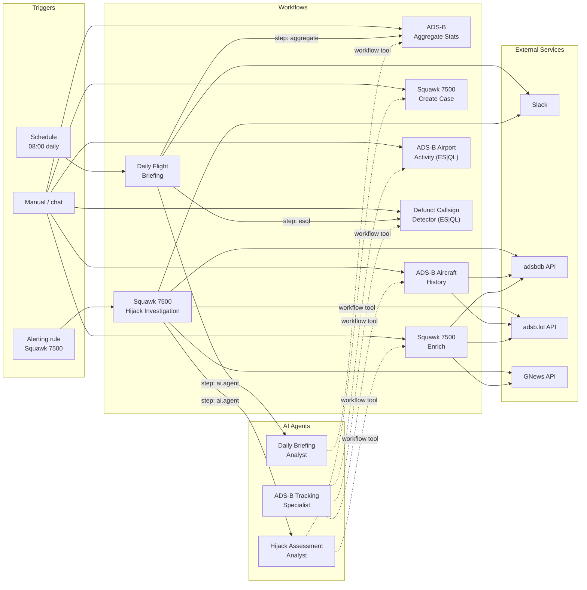
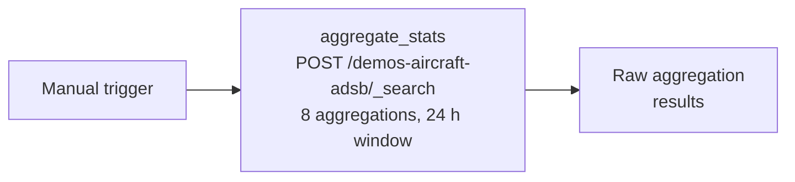
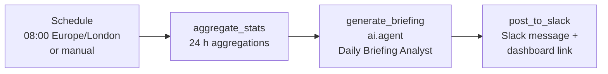
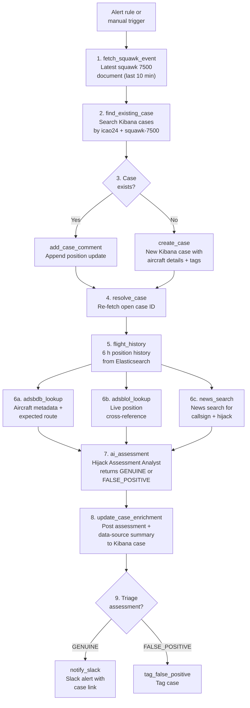
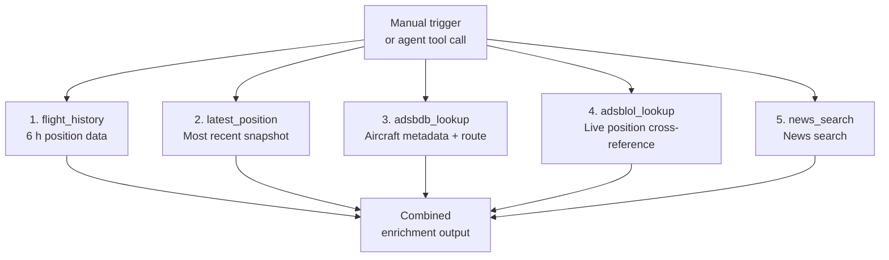
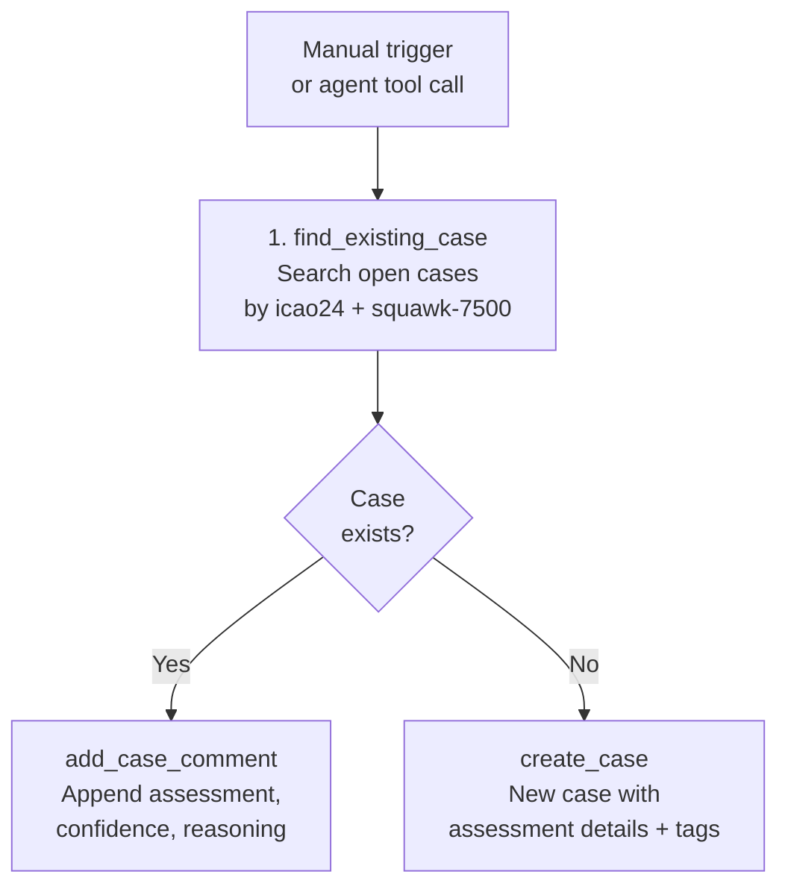
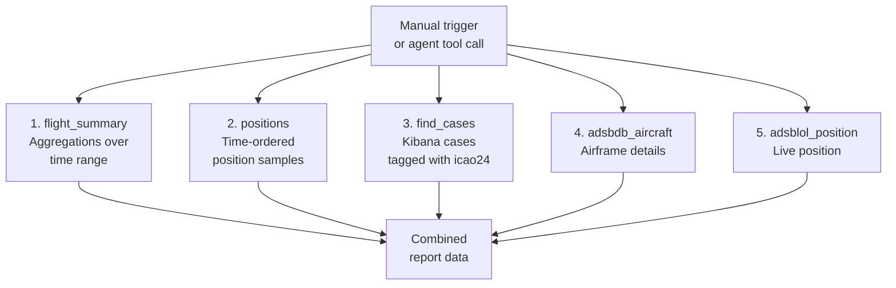
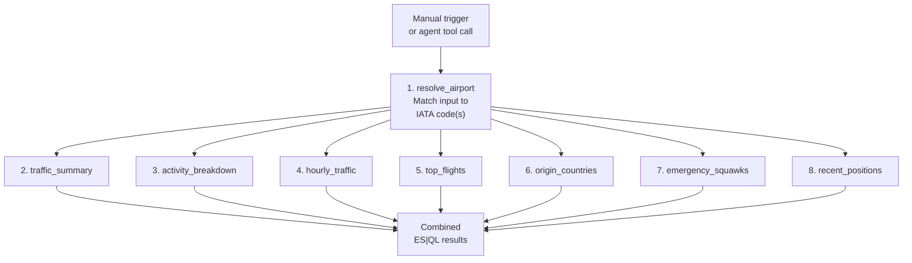
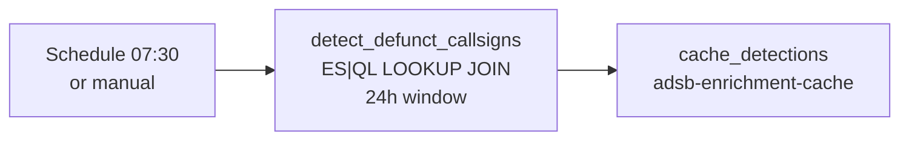
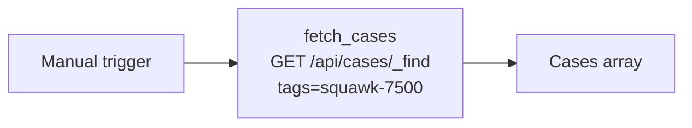

# Workflows

Kibana Workflows are YAML-defined automations that run inside the Elastic Stack.
Each file in this directory describes a workflow that is deployed to Kibana by
`setup.sh` (or `make setup`). Workflows can be triggered manually, on a
schedule, or by an alerting rule, and they orchestrate Elasticsearch queries,
external HTTP calls, AI agent invocations, Kibana case management, and Slack
notifications.

## Inventory

| File                                    | Trigger                                  | Purpose                                                                      |
| --------------------------------------- | ---------------------------------------- | ---------------------------------------------------------------------------- |
| `adsb-aggregate-stats.yaml`             | Manual                                   | Aggregate 24 h of ADS-B statistics (also exposed as an agent tool)           |
| `daily-flight-briefing.yaml`            | Scheduled (08:00 Europe/London) + manual | AI-generated daily briefing posted to Slack                                  |
| `squawk-7500-hijack-investigation.yaml` | Alert + manual                           | End-to-end hijack signal investigation with case management                  |
| `squawk-7500-enrich.yaml`               | Manual (agent tool)                      | Gather enrichment data for a squawk 7500 investigation                       |
| `squawk-7500-create-case.yaml`          | Manual (agent tool)                      | Create or update a Kibana case for a squawk 7500 investigation               |
| `adsb-aircraft-history.yaml`            | Manual (agent tool)                      | Aircraft history report — aggregations, positions, external APIs             |
| `adsb-airport-activity.yaml`            | Manual (agent tool)                      | Airport activity report — ES\|QL traffic, flights, hourly profile            |
| `adsb-defunct-callsign-detector.yaml`   | Scheduled (07:30 Europe/London) + manual | Detect aircraft using defunct airline callsign prefixes (ES\|QL LOOKUP JOIN) |
| `hijack-cases-summary.yaml`             | Manual (agent tool)                      | Fetch squawk 7500 investigation cases for the daily briefing                 |

## System overview

The diagram below shows how workflows, AI agents, triggers, and external
services connect.



> Solid arrows are direct step invocations. Dashed arrows show workflows
> registered as tools that an agent can call during a chat session.

______________________________________________________________________

## 1. ADS-B Aggregate Stats

**File:** `adsb-aggregate-stats.yaml`
**Trigger:** manual
**Index:** `demos-aircraft-adsb`
**Tags:** `adsb`, `aggregation`

Runs eight aggregations over the last 24 hours of ADS-B position data and
returns the raw results. It is both a standalone workflow and a registered
workflow tool that the Daily Briefing Analyst agent can invoke on demand.

**Aggregations returned:**

| Key                    | What it measures                                                                  |
| ---------------------- | --------------------------------------------------------------------------------- |
| `unique_aircraft`      | Cardinality of `icao24`                                                           |
| `busiest_airports`     | Top 10 airports by unique flights (`icao24:callsign`)                             |
| `origin_countries`     | Top 10 countries by unique aircraft                                               |
| `activity_breakdown`   | Arriving, departing, taxiing, overflight, at_airport (airport airspace zone only) |
| `traffic_by_subregion` | Top 15 UN subregions by unique aircraft                                           |
| `traffic_by_continent` | Top 7 continents by unique aircraft                                               |
| `ground_vs_airborne`   | Ground / airborne split by unique aircraft                                        |
| `emergency_squawks`    | Named filters for 7500 (hijack), 7600 (radio failure), 7700 (general emergency)   |



______________________________________________________________________

## 2. Daily Flight Briefing

**File:** `daily-flight-briefing.yaml`
**Trigger:** scheduled (daily at 08:00 Europe/London) + manual
**Index:** `demos-aircraft-adsb`
**Agent:** `adsb_daily_briefing_agent`
**Connector:** Slack webhook
**Tags:** `adsb`, `briefing`, `scheduled`, `ai`

Produces an AI-written daily briefing from the same 24-hour aggregations used by
the Aggregate Stats workflow, then posts it to a Slack channel with a link to the
Kibana dashboard.

The `generate_briefing` step sends the aggregation JSON to the Daily Briefing
Analyst agent with formatting instructions for Slack mrkdwn (bold via single
asterisks, code-block tables for ranked data, IATA codes with full airport
names).



______________________________________________________________________

## 3. Squawk 7500 Hijack Investigation

**File:** `squawk-7500-hijack-investigation.yaml`
**Trigger:** alert (squawk 7500 alerting rule) + manual
**Index:** `demos-aircraft-adsb`
**Agent:** `adsb_hijack_assessment_agent`
**External APIs:** adsbdb, adsb.lol, GNews
**Connector:** Slack webhook
**Tags:** `adsb`, `squawk-7500`, `hijack`, `alert`, `ai`, `cases`

The main investigation workflow. When the squawk 7500 alerting rule fires it
runs an end-to-end investigation: fetch the triggering event, deduplicate via
Kibana case management, enrich with internal flight history and three external
APIs, invoke the Hijack Assessment Analyst agent for an AI-powered
genuine-or-false-positive triage assessment, update the case, and route the
outcome — Slack alert for genuine threats, tagging for false positives.



**Step-by-step summary:**

1. **fetch_squawk_event** -- queries the most recent squawk 7500 document from
   the last 10 minutes.
2. **find_existing_case** -- searches Kibana cases tagged with the aircraft's
   `icao24` and `squawk-7500` to avoid duplicate investigations.
3. **handle_case** (branch) -- if an open case exists, appends a position-update
   comment; otherwise creates a new case with full aircraft details and tags.
4. **resolve_case** -- re-fetches the open case so subsequent steps have its ID
   regardless of which branch executed.
5. **flight_history** -- retrieves the last 6 hours of position data for the
   aircraft from Elasticsearch.
6. **External enrichment** (three HTTP calls, each with `on-failure: continue`):
   - **adsbdb_lookup** -- aircraft registry metadata and expected flight route.
   - **adsblol_lookup** -- independent live-position cross-reference.
   - **news_search** -- news articles mentioning the callsign and "hijack"
     (requires `GNEWS_API_KEY`).
7. **ai_assessment** -- sends all enrichment data to the Hijack Assessment
   Analyst agent, which returns a structured triage assessment (`genuine` or
   `false_positive`) with confidence and reasoning.
8. **update_case_enrichment** -- posts the AI assessment and a data-source
   summary as a comment on the Kibana case.
9. **route_triage** (branch) -- if the AI triage assessment is `genuine`, sends
   a Slack alert with aircraft details and a case link; otherwise tags the case
   as a false positive.

______________________________________________________________________

## 4. Squawk 7500 Enrich

**File:** `squawk-7500-enrich.yaml`
**Trigger:** manual (registered as a workflow tool for the Hijack Assessment Analyst)
**Index:** `demos-aircraft-adsb`
**External APIs:** adsbdb, adsb.lol, GNews
**Tags:** `adsb`, `squawk-7500`, `enrichment`

A utility workflow that gathers all enrichment data for a given aircraft. It is
designed to be called by the Hijack Assessment Analyst agent during interactive
chat sessions (as opposed to the fully automated investigation workflow, which
does its own enrichment inline).

**Inputs:**

| Name       | Type   | Required | Description                                    |
| ---------- | ------ | -------- | ---------------------------------------------- |
| `icao24`   | string | yes      | ICAO 24-bit aircraft address (hex)             |
| `callsign` | string | no       | Flight callsign (improves adsbdb route lookup) |



______________________________________________________________________

## 5. Squawk 7500 Create Case

**File:** `squawk-7500-create-case.yaml`
**Trigger:** manual (registered as a workflow tool for the Hijack Assessment Analyst)
**Tags:** `adsb`, `squawk-7500`, `cases`

Creates or updates a Kibana case for a squawk 7500 investigation. Deduplicates
by searching for an existing open case tagged with the aircraft's `icao24`. If
one exists, adds the assessment as a comment; otherwise creates a new case.

**Inputs:**

| Name                | Type   | Required | Description                        |
| ------------------- | ------ | -------- | ---------------------------------- |
| `icao24`            | string | yes      | ICAO 24-bit aircraft address (hex) |
| `callsign`          | string | no       | Flight callsign                    |
| `triage_assessment` | string | yes      | `genuine` or `false_positive`      |
| `confidence`        | string | yes      | Confidence score (0--1)            |
| `reasoning`         | string | yes      | Full assessment reasoning text     |



______________________________________________________________________

## 6. ADS-B Aircraft History Report

**File:** `adsb-aircraft-history.yaml`
**Trigger:** manual (registered as a workflow tool for the ADS-B Tracking Specialist)
**Index:** `demos-aircraft-adsb`
**External APIs:** adsbdb, adsb.lol
**Tags:** `adsb`, `aircraft`, `history`, `report`

Generates a comprehensive history report for an individual aircraft over a
configurable time range. Includes flight summary aggregations, time-ordered
position data, related Kibana cases, airframe details from adsbdb, and live
position from adsb.lol. Designed as a workflow tool for the ADS-B Tracking
Specialist agent.

**Inputs:**

| Name       | Type   | Required | Default   | Description                        |
| ---------- | ------ | -------- | --------- | ---------------------------------- |
| `icao24`   | string | yes      | —         | ICAO 24-bit aircraft address (hex) |
| `lookback` | string | no       | `now-24h` | Lookback period in ES date math    |



______________________________________________________________________

## 7. ADS-B Airport Activity Report

**File:** `adsb-airport-activity.yaml`
**Trigger:** manual (registered as a workflow tool for the ADS-B Tracking Specialist)
**Index:** `demos-aircraft-adsb`
**Tags:** `adsb`, `airport`, `activity`, `report`, `esql`

Generates a comprehensive activity report for an airport over a configurable
time range. This is the first ES|QL workflow in the project — all eight steps
use `elasticsearch.esql.query` instead of Query DSL. Accepts free-text airport
names (e.g. "Heathrow"), IATA codes (e.g. "LHR"), or ICAO/GPS codes (e.g.
"EGLL") and resolves them via case-insensitive matching.

**Inputs:**

| Name       | Type   | Required | Default   | Description                               |
| ---------- | ------ | -------- | --------- | ----------------------------------------- |
| `airport`  | string | yes      | —         | Airport name, IATA code, or ICAO/GPS code |
| `lookback` | string | no       | `now-24h` | Lookback period in ES date math           |

**Steps:**

| #   | Step name            | What it returns                                                    |
| --- | -------------------- | ------------------------------------------------------------------ |
| 1   | `resolve_airport`    | Up to 5 matching airports (IATA code, name, type, Wikipedia link)  |
| 2   | `traffic_summary`    | Unique aircraft, unique flights, total observations, time range    |
| 3   | `activity_breakdown` | Deduplicated flight counts by activity (arriving, departing, etc.) |
| 4   | `hourly_traffic`     | Unique aircraft per hour (for peak/quiet analysis)                 |
| 5   | `top_flights`        | Up to 25 callsigns with time windows, origin countries, activity   |
| 6   | `origin_countries`   | Up to 15 countries by unique aircraft count                        |
| 7   | `emergency_squawks`  | Unique aircraft per emergency squawk code (7500, 7600, 7700)       |
| 8   | `recent_positions`   | Up to 500 recent position observations with full field set         |

All steps return ES|QL columnar output (`columns` + `values` arrays).



______________________________________________________________________

## 8. Defunct Callsign Detector

**File:** `adsb-defunct-callsign-detector.yaml`
**Trigger:** scheduled (daily at 07:30 Europe/London) + manual (registered as a workflow tool)
**Index:** `demos-aircraft-adsb` (source), `adsb-airlines-defunct` (lookup)
**Tags:** `adsb`, `callsign`, `defunct`, `esql`

Cross-references the last 24 hours of ADS-B callsign prefixes against a lookup
index of 781 known defunct airlines using ES|QL LOOKUP JOIN. Detects aircraft
broadcasting callsign prefixes that match airlines which have ceased operations.

Results are investigative leads — matches may indicate stale transponder
configurations, reallocated ICAO designators, or genuinely suspicious activity.
The workflow also runs inline as a step in the Daily Flight Briefing.

**ES|QL query:**

The core query extracts the 3-character prefix from each callsign, joins against
the `adsb-airlines-defunct` lookup index, filters to matches, and aggregates by
defunct airline with aircraft counts and observed callsigns.

**Steps:**

| #   | Step name                  | What it does                                                |
| --- | -------------------------- | ----------------------------------------------------------- |
| 1   | `detect_defunct_callsigns` | ES                                                          |
| 2   | `cache_detections`         | Write results to `adsb-enrichment-cache` (Stack workaround) |



______________________________________________________________________

## 9. Hijack Cases Summary

**File:** `hijack-cases-summary.yaml`
**Trigger:** manual (registered as a workflow tool)
**Tags:** `adsb`, `squawk-7500`, `cases`, `briefing`

Fetches squawk 7500 (hijack) investigation cases from Kibana case management.
Returns case titles, tags (including `triage:genuine` or `triage:false_positive`),
and status for use in the daily briefing or interactive queries.



______________________________________________________________________

## AI agents

Three AI agents are deployed alongside these workflows. Each agent can be used
directly via the Kibana Agent Builder chat interface, and each has workflow tools
registered so it can trigger workflows on the user's behalf.

### ADS-B Tracking Specialist (`adsb_agent`)

- **Config:** `../agents/adsb-agent.json`
- **Workflow tools:** `adsb-aircraft-history`, `adsb-airport-activity`, `adsb-defunct-callsign-detector`
- **Role:** General-purpose flight tracking and ad-hoc ADS-B queries. Uses the
  Aircraft History workflow for per-aircraft reports, the Airport Activity
  workflow for per-airport reports, and the Defunct Callsign Detector for
  identifying aircraft using callsign prefixes of defunct airlines. Also has
  direct Elasticsearch platform tools for ad-hoc queries.

### Daily Briefing Analyst (`adsb_daily_briefing_agent`)

- **Config:** `../agents/adsb-daily-briefing-agent.json`
- **Workflow tools:** `adsb-aggregate-stats`
- **Role:** Generates and discusses daily ADS-B flight briefings. When a user
  asks for a briefing in chat, the agent calls the Aggregate Stats workflow,
  waits for results, and formats them into a structured report. The Daily Flight
  Briefing workflow also runs the Defunct Callsign Detector query inline (section
  8\) and includes matches as section 11 of the briefing.

### Hijack Assessment Analyst (`adsb_hijack_assessment_agent`)

- **Config:** `../agents/adsb-hijack-assessment-agent.json`
- **Workflow tools:** `squawk-7500-enrich`, `squawk-7500-create-case`
- **Role:** Assesses whether a squawk 7500 signal is genuine or a false
  positive. In interactive chat mode, calls the Enrich workflow to gather data,
  then presents a triage assessment. Can optionally open a Kibana case via the
  Create Case workflow. In automated mode (called by the Hijack Investigation
  workflow), it receives pre-gathered data and returns a structured assessment
  directly.

______________________________________________________________________

## Deployment

All workflows, their associated agent tool registrations, the Slack connector,
and the squawk 7500 alerting rule are deployed by `setup.sh`:

```bash
# Deploy everything
make setup

# Deploy only workflows (and their tool registrations)
./setup.sh --only workflows

# Re-deploy workflows, overwriting existing
./setup.sh --only workflows --force
```

See the project [README](../../README.md) and [AGENTS.md](../../AGENTS.md) for
full setup instructions.

## Workflow authoring tips

Gotchas discovered during development. See also [Known Quirks](../../AGENTS.md#known-quirks)
in AGENTS.md for the full list.

### Indexing documents from step outputs

The `elasticsearch.index` step type does not support `| json` filters or `${{ }}`
type-preserving expressions in its `document` body. Nested objects are silently
serialised as the string `[object Object]`.

Use `elasticsearch.request` with `method: PUT` instead:

```yaml
- name: cache_result
  type: elasticsearch.request
  with:
    method: PUT
    path: "/my-index/_doc/{{ inputs.id }}"
    body:
      label: "{{ inputs.label }}"
      data: "{{ steps.http_call.output | json }}"
```

The `| json` filter serialises the object as a JSON string that Elasticsearch
stores as a `text` field. Consumers parse the string to access nested values.

### Handling missing indices in `if` conditions

When a step with `on-failure: continue: true` fails (e.g. searching an index
that does not exist), its output is `null`. An `if` condition referencing that
output evaluates unpredictably — `null` is not `0`, so
`${{ steps.X.output.hits.total.value == 0 }}` is false when the step failed.
Design for the first-run case where the index may not exist yet, or use
always-write patterns instead of check-before-write.

### Passing step data to agents

Workflow `outputs` are not functional on Stack 9.3.x (quirk #4). Two patterns
for getting external data to agents:

1. **`ai.agent` step** (for autonomous workflows) — assemble all step outputs
   into the agent message using `{{ steps.X.output | json:2 }}`. The agent
   receives the data inline. Used by `squawk-7500-hijack-investigation`.

2. **Cache index** (for agent-called tools) — write HTTP responses to an ES
   index via `elasticsearch.request` PUT, then tell the agent to query the
   cache index as a fallback. Used by `adsb-aircraft-history` and
   `squawk-7500-enrich`.
